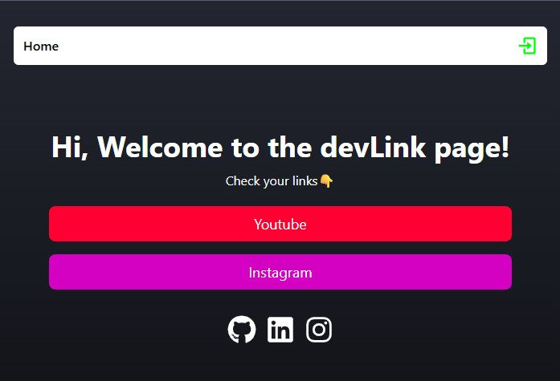
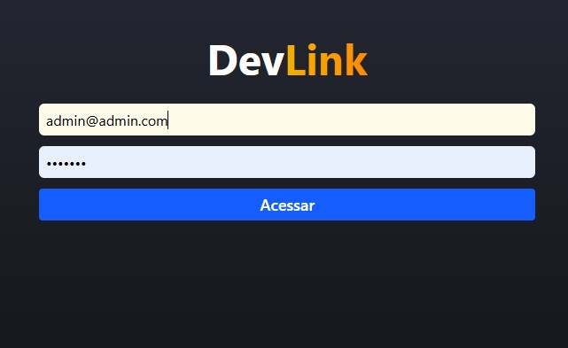
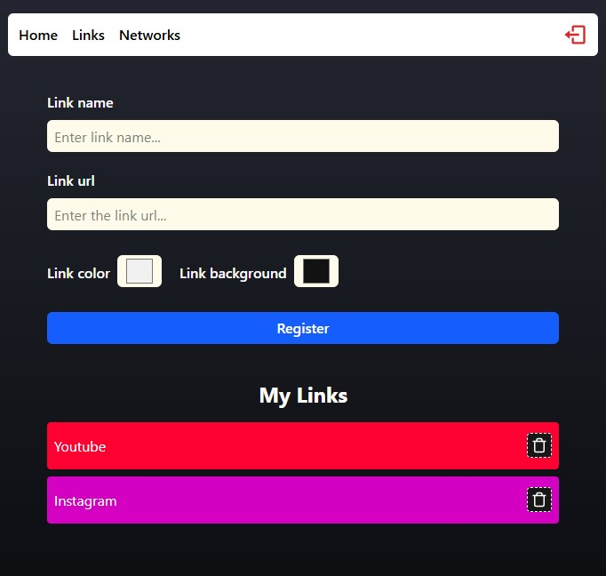
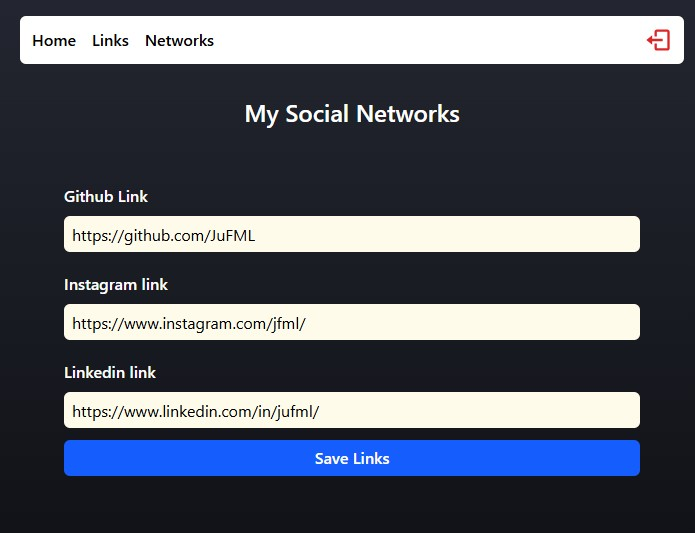

<h1 align="center">
    DevLinks
</h1>

<h1 align="center">
  
  
  
  
</h1>

<h3 align="center">
  <a href="https://devlinks-ju.netlify.app/" target="_blank">Access demo page</a>
<h3 >

# Index

- [About](#-about)
- [Technologies used](#-technologies-used)
- [How to install and run the project](#-how-to-install-and-run-the-project)

## 🔖&nbsp; About

DevLinks is a simple application created to allow users to register and manage their personal links and social media profiles. Once logged in, users can create, edit, and delete links, and all of their saved links are displayed on a public home page.
The system includes authentication and protected routes to ensure only authorized users can access and manage their content.

---

## 🚀 Technologies used

The project was developed using the following technologies

- ReactJS
- TypeScript
- Firebase Authentication
- Firebase Firestore
- React Router DOM
- Tailwind CSS

---

## 🗂 How to install and run the project

```bash
# Clone the repository
git clone https://github.com/your-username/devlinks.git

# Enter the project folder
cd devlinks

# Install dependencies
npm install

# Run the project
npm run dev
```
---

Developed ❤ by Juliana Fernandez